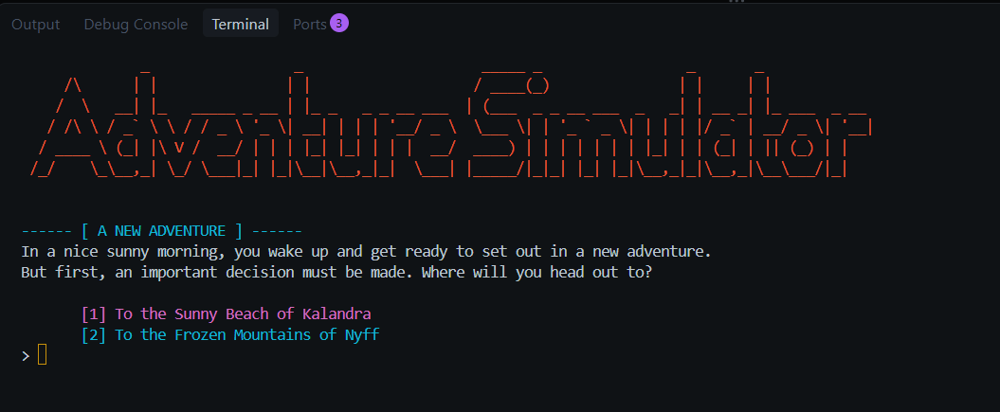

# Adventure Simulator Lua

A branching terminal adventure where every choice carries a cost. Explore Kalandra's sunken wreck and hidden dungeon, or brave the frozen mountains of Nyff, and try to make it out alive.



## Features

- Two distinct story paths
- Branching choices with survival and game-over endings
- A hidden golden key and locked dungeon in Kalandra
- ASCII art and ANSI-colored terminal output
- Modular, file-based node system

## Usage

Run from the `src` directory:

```bash
cd src
lua main.lua
```

## Requirements

- Lua 5.4 or higher

## License

This project is licensed under the MIT License. See [LICENSE](LICENSE) for details.
